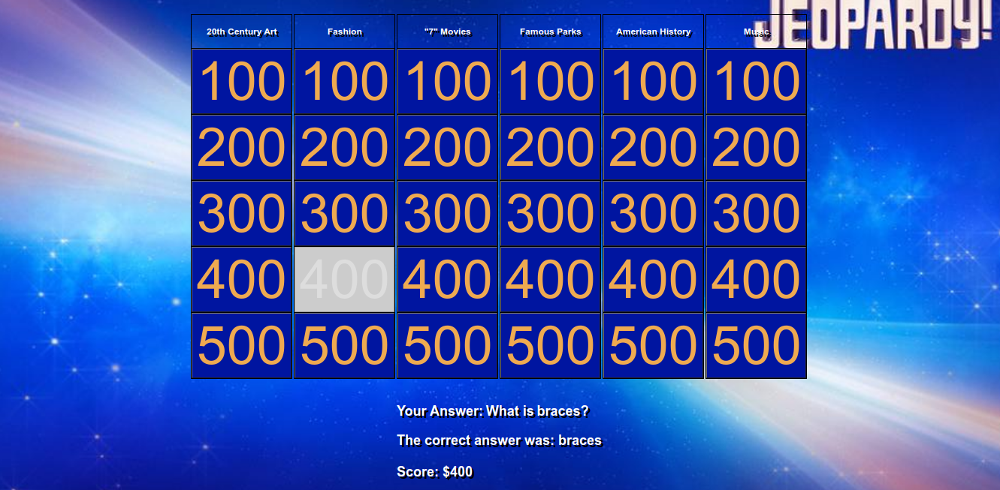
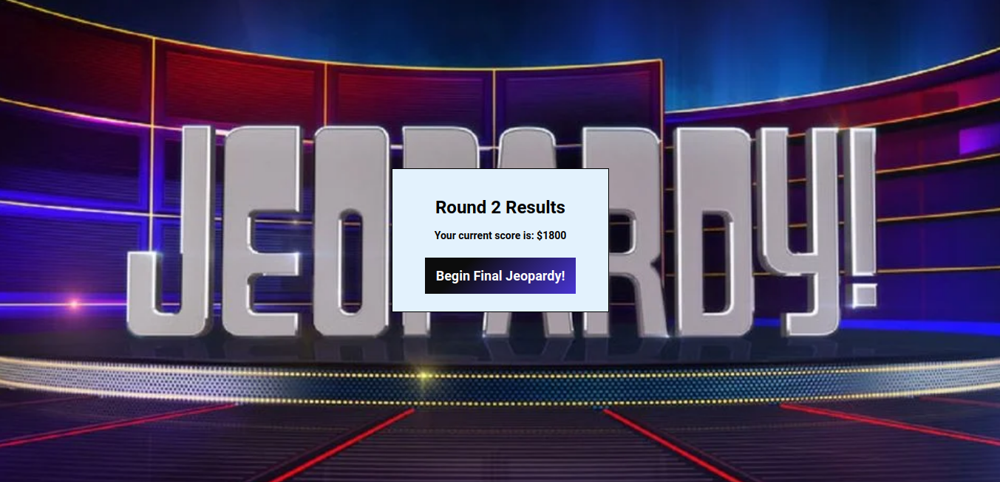
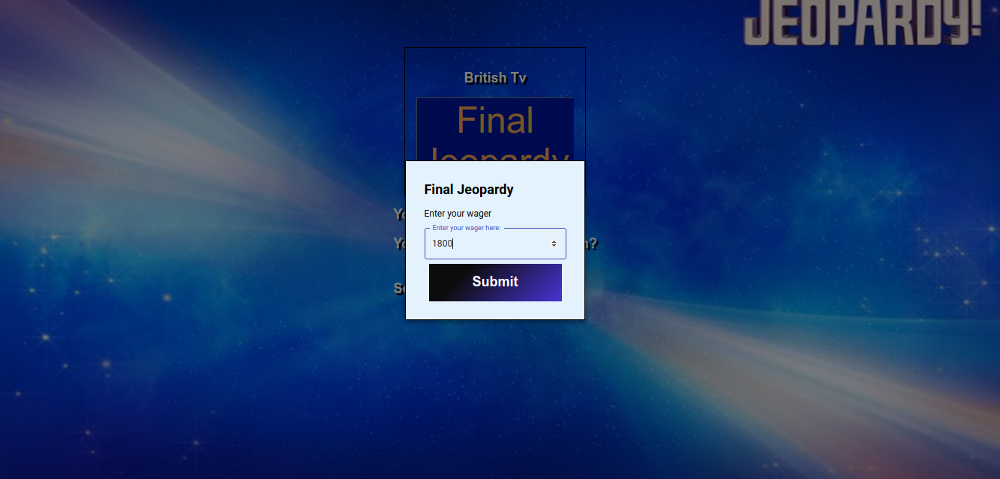
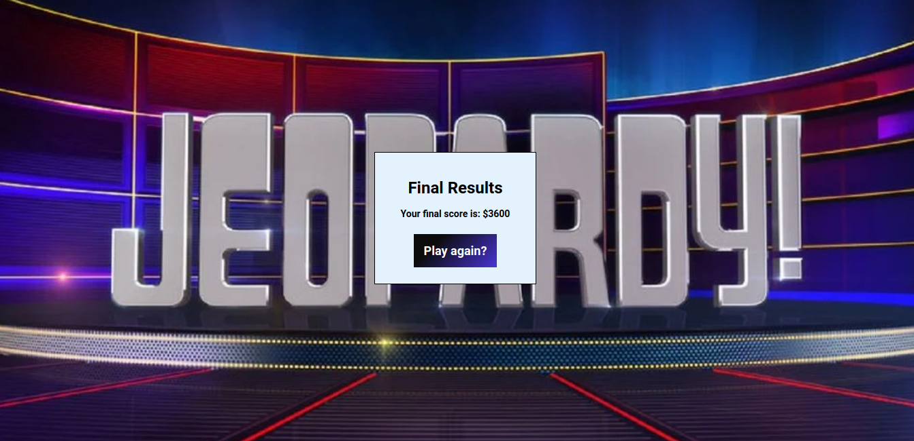
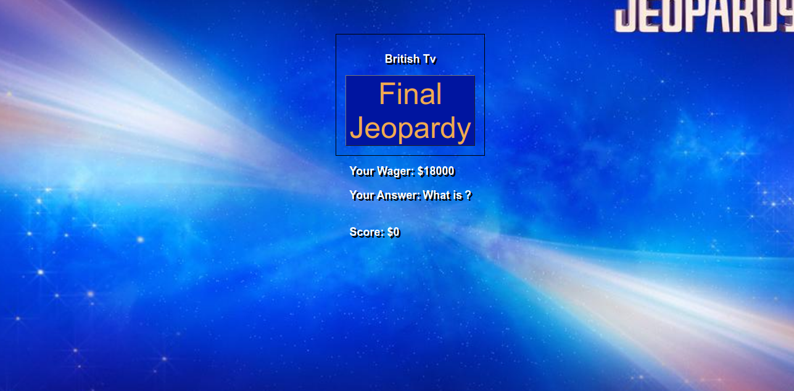

# Jeopardy

Jeopardy game built for [Mintbean JavaScript Hacks: Hack the QUiz Platform](https://www.mintbean.io/meets). This was a one week hackathon running from November 13 - 19, 2020.

## Table of Contents
* [Live Deploy](#live-deploy)
* [The Challenge](#the-challenge)
* [Rules and Constraints](#rules-and-constraints)
* [Screenshots](#screenshots)
* [Tech Stack](#tech-stack)
* [User Stories](#user-stories)
* [Development](#development)
  * [Dependencies](#dependencies)
  * [Setup](#setup)
  * [Contributors](#contributors)

### Live Deploy

<b>Check out the app on Netlify at [https://jeopardy-hackathon.netlify.app/](https://jeopardy-hackathon.netlify.app/)</b>

### The Challenge

<b>The Mayor of Mintropolis has acquisitioned an application to Memorialize the late Alex Trebek.</b>

Alex Trebek Hosted the Mayors favorite game show Jeopardy from 1984-2020 needless to be said he will be missed.

He is asking the developers of Mintropolis create a Quiz Platform that will help this legend's memory live on.  

"Jeopardy!" is a classic game show -- with a twist. The answers are given first, and the contestants supply the questions. A user will compete in six categories and in three rounds (with each round's "answers" being worth more prize money). In the third round, "Final Jeopardy," the user can name their own jackpot -- as long as it's within the amount of money they've already earned. If a User finishes the second round with zero dollars, they are eliminated from "Final Jeopardy."  

### Rules & Constraints
Rules and constraints help keep everybody's projects relevant and interesting to all other participants. 

The only restrictions are the following:

1. You must build a frontend web application. 
2. There must be no backend server/serverless components.
3. The project is scoped for teams of 1 - 3.

### Screenshots

### Tech Stack
* React (Create React App)
* Redux
* React Router
* Axios
* Jservice.io API
* Netlify
* CSS
* Material UI

### User Stories
1. As a user, When the page loads a landing page asking if I want to play 
2. As a user, When Click play a game board appears
3. As a user, When I look at the game board I see 6 columns each with
  * A category
  * 5 questions with increasing point values
4. As a user, when I click on a point value I will be asked a question
5. As a user, once the question has been asked I can see a timer showing me the time I have to answer a question
6. As a user, If I fail to answer a question in the given time the question will close and my score will be unaffected 
7. As a user, If I answer a question correctly my score will be increased by the point value on the on the question selected
8. As a user, If I answer a question incorrectly my score will be decreased by the point value on the questions selected 
9. As a user, After a unseen period of time the game will start the next round
10. As a user, at the start of the 2nd round the game board is refilled and I continue like the first round
11. As a user, at the start of the third round I am given a question and asked to wager from my earned points 
12. As a user, if I answer the third round question correctly I gain the value of my wager
13. As a user, if I answer the third round question incorrectly I lose the value of my wager
14. As a user, after the third round I am shown my score and asked if I want to play again

## Development

### Dependencies

* @material-ui/core: ^4.11.0
* @reduxjs/toolkit: ^1.1.0
* @testing-library/jest-dom: ^4.2.4
* @testing-library/react: ^9.3.2
* @testing-library/user-event: ^7.1.2
* axios: ^0.21.0
* react: ^17.0.1
* react-dom: ^17.0.1
* react-redux: ^7.2.2
* react-router-dom: ^5.2.0
* react-scripts: 4.0.0
* react-spring: ^8.0.27
* redux: ^4.0.5
* redux-devtools-extension: ^2.13.8
* redux-thunk: ^2.3.0

### Setup
1. Fork this repository
2. Navigate to the directory where you want to store this project
3. git clone your forked directory
4. Navigate to the cloned directory
5. Run npm install to install all project dependencies
6. Run the app with npm start

### Contributors

Questions? Comments?

Andrew Lloyd [Github](https://github.com/AndrewRLloyd88) [Portfolio](https://arlmedia.ca/)
Kelsi Proulx [Github](https://github.com/kelsi2) [Portfolio](https://www.kelsidev.net/)

README: Last updated November 18, 2020